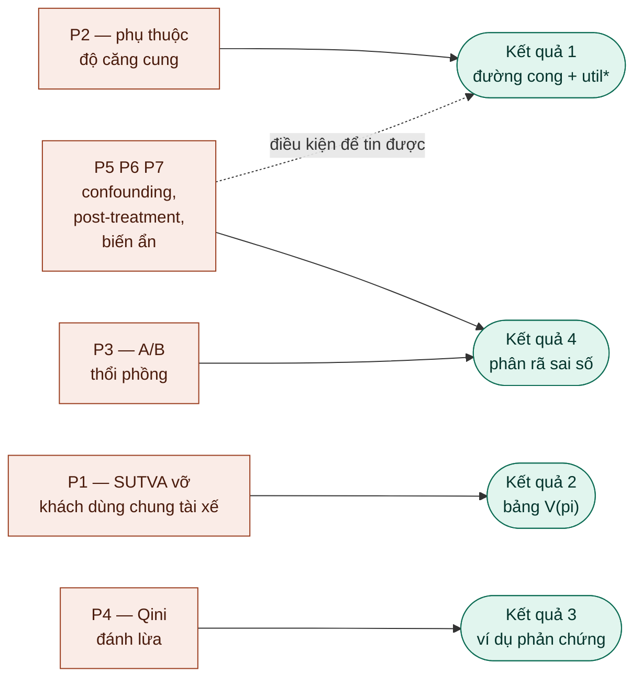
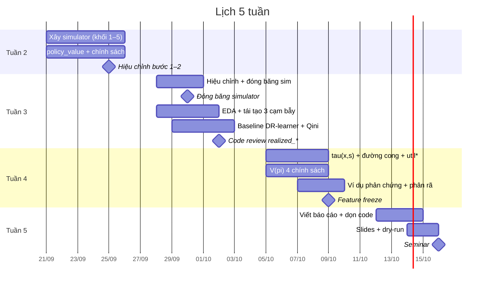

# Kế hoạch triển khai — Supply-Aware Promotion Uplift

**Thời lượng:** 5 tuần · **Nhân sự:** 2 intern · **Dữ liệu:** mô phỏng (tự xây simulator)
**Cập nhật:** 18/09/2026

---

## 1. Mục tiêu

> Chứng minh bằng số rằng chính sách phát voucher **biết trạng thái cung** tạo ra
> nhiều chuyến hoàn thành hơn chính sách uplift thông thường dưới cùng ngân sách,
> và rằng **Qini có thể xếp hạng ngược với giá trị thật**.

Đề tài coi là **thất bại** nếu chỉ dừng ở "đã train được mô hình uplift, Qini = 0.xx".

---

## 2. Đầu ra của đề tài

### 2.1 Sản phẩm nộp

| Sản phẩm | Nội dung |
|---|---|
| **Báo cáo** | Trả lời được 4 kết quả ở mục 2.2 |
| **Repo code** | Đã dọn, chạy lại được từ đầu với seed cố định |
| **Slides** | Seminar 30 phút |
| **Simulator** | `marketplace_sim.py` đã hiệu chỉnh và đóng băng |

### 2.2 Bốn kết quả bắt buộc

**(1) Đường cong hiệu quả voucher theo độ căng cung.**
Trục ngang `util_lag`, trục dọc `τ_completed`, kèm khoảng tin cậy (bootstrap).
Xác định **ngưỡng `util*`** — mức mà từ đó voucher không còn tạo giá trị.

**(2) Bảng so sánh chính sách.**
Ít nhất 4 chính sách dưới **cùng ngân sách**, đo bằng `V(π)`:

| Chính sách | Mô tả |
|---|---|
| `treat_none` | Không phát cho ai |
| `treat_all` | Phát cho tất cả |
| `greedy_tau` | Greedy theo `τ̂(x)` — không biết trạng thái cung |
| `greedy_tau_s` | Greedy theo `τ̂(x, s)` — có biết trạng thái cung |
| `oracle` *(nếu kịp)* | Cận trên, dùng ground truth |

**(3) Ví dụ phản chứng Qini ↔ V(π).** *(kết quả quan trọng nhất)*
Một cặp chính sách B, C sao cho `Qini(B) > Qini(C)` nhưng `V(B) < V(C)`.

**(4) Định lượng ba nguồn sai số.**
Khoảng cách giữa ước lượng naive và ground truth đến từ đâu:

| Nguồn | Đo thế nào |
|---|---|
| Confounding | Naive (+1%) so với randomized (+44%) |
| Interference | Randomized (+44%) so với GTE (+20.4%) |
| Capacity | `τ` lên `request` so với `τ` lên `completed` |

### 2.3 Giá trị mang lại

| Đầu ra | Giá trị |
|---|---|
| Ngưỡng `util*` có CI | Thay quy tắc cảm tính của vận hành bằng con số |
| Bảng so sánh `V(π)` | Cho biết chính sách biết cung hơn bao nhiêu chuyến |
| Ví dụ Qini vs `V(π)` | Cảnh báo cách duyệt mô hình hiện tại có thể sai |
| Phân rã 3 nguồn sai số | Giúp đội biết nên ưu tiên sửa cái nào |
| Phát hiện lỗi `realized_*` | Sửa được ngay, không cần chờ mô hình |

---

## 3. Bảy vấn đề then chốt và nơi giải quyết

| # | Vấn đề | Cách xử lý | Tuần | Bằng chứng |
|---|---|---|---|---|
| P1 | Khách dùng chung tài xế (vi phạm SUTVA) | Dùng `V(π)` làm ground truth | 2 | Hàm `policy_value` |
| P2 | Hiệu quả phụ thuộc độ căng cung | `τ(x, s)` với `*_lag` | 4 | Đường cong + `util*` |
| P3 | A/B chia theo user thổi phồng | Đo GTE từ simulator | 2–3 | +44% vs +20.4% |
| P4 | Qini cao chưa chắc nhiều chuyến hơn | So Qini và `V(π)` song song | 3–4 | Ví dụ phản chứng |
| P5 | Confounding từ luật phát voucher cũ | Lát randomized + DR-learner | 2–3 | +1% vs +44% |
| P6 | Dùng số liệu sau khi phát voucher | Whitelist feature + code review | 2–3 | Mô hình phản diện |
| P7 | Yếu tố ảnh hưởng không có trong dữ liệu | Sensitivity analysis | 4 | `util*` có đổi không |

---

## 4. Mốc thời gian

Giả định tuần 2 bắt đầu **thứ Hai 21/09/2026**, seminar **thứ Sáu 16/10/2026**.

| Tuần | Ngày | Chủ đề |
|---|---|---|
| 1 | — | *(đã xong)* Đọc tài liệu, viết trang critical problems |
| 2 | 21–25/09 | Xây simulator |
| 3 | 28/09–02/10 | Hiệu chỉnh + `policy_value` + baseline |
| 4 | 05–09/10 | Supply-aware + so sánh chính sách. **Chốt kết quả** |
| 5 | 12–16/10 | Viết, dọn code, slides, seminar |

### Mốc cứng

| Ngày | Mốc |
|---|---|
| T2 21/09 | Chốt chữ ký `run_sim` và `policy` |
| T6 25/09 | Simulator ra được 3 con số nghiệm thu |
| T4 30/09 | **Đóng băng simulator** — ghi commit hash + tham số |
| T5 02/10 | Code review: grep `realized_` toàn repo |
| T5 09/10 | **Feature freeze** — không chạy thí nghiệm mới |
| T4 15/10 | Dry-run seminar trước mentor |
| T6 16/10 | **Seminar** |

---

## 5. Tuần 1 — Đã hoàn thành

| Đã xong | Chưa xong |
|---|---|
| Đọc Blake & Coey (2014), Bright et al. (2024), blog Lyft | Chưa có simulator |
| Viết trang critical problems (P1–P7) | Chưa có `policy_value` |
| Hiểu cơ chế cung căng, wild goose chase, bias của A/B | Chưa làm EDA |

---

## 6. Tuần 2 (21–25/09) — Xây simulator

**Mục tiêu:** có simulator chạy được, ra đúng ba con số nghiệm thu.

| Việc | Ưu tiên | Ai |
|---|---|---|
| Chốt `SimConfig` và chữ ký `run_sim` / `policy` | P0 | Chung |
| Khối sinh rider, gán voucher, quyết định đặt xe, ghi trạng thái | P0 | A |
| Khối ghép chuyến bản A (trần công suất) | P0 | A |
| Chế độ `--selfcheck` in 3 con số + phân phối `util_lag` | P0 | A |
| Hàm `policy_value` + unit test | P0 | B |
| Bốn chính sách cơ bản | P0 | B |
| Whitelist feature + hàm chặn `realized_*` | P0 | B |
| README: định nghĩa `ucr`, các đánh đổi, tham số | P0 | B |
| Hiệu chỉnh tham số (5 bước, xem `ARCHITECTURE.md`) | P0 | Chung |

**Đầu ra:** `marketplace_sim.py` chạy được, `--selfcheck` ra ~+1% / ~+44% / ~+20%,
`policy_value` có test.

**Điều kiện qua tuần:** ba con số nghiệm thu nằm trong khoảng hợp lý và
`util_lag` trải từ ~0.4 tới ~0.98.

### Ranh giới vai trò

Người viết khối gán voucher và khối ghép chuyến (nơi cài confounding và
interference) **không** viết code phân tích tuần 3–4. Đến khi phân tích xong mới
đối chiếu tham số thật. Giữ được tinh thần "tự phát hiện" mà đề tài đặt ra.

---

## 7. Tuần 3 (28/09–02/10) — Hiệu chỉnh và baseline

**Mục tiêu:** có mô hình baseline và bằng chứng đầu tiên rằng Qini đánh lừa.

| Việc | Ưu tiên | Ai |
|---|---|---|
| Hoàn tất hiệu chỉnh, **đóng băng simulator** (T4 30/09) | P0 | Chung |
| EDA: phân phối `util_lag`, `completed` theo cell | P0 | A |
| Tái tạo bảng ba cạm bẫy bằng code phân tích riêng | P0 | A |
| DR-learner trên `completed`, **không** dùng trạng thái cung | P0 | B |
| Tính Qini cho baseline | P0 | B |
| Tính `V(π)` cho baseline, đặt cạnh Qini | P0 | B |
| Hàm phân bổ ngân sách (ngưỡng điểm) | P0 | B |
| Khối ghép chuyến bản B (wild goose chase) | P1 | A |
| Đo độ lệch A/B theo `explore_frac` | P1 | A |
| Mô hình phản diện dùng `realized_*` để minh hoạ lỗi | P2 | A |

**Đầu ra:** bảng đối chiếu Qini vs `V(π)` cho baseline, hàm phân bổ sẵn sàng.

**Code review T5 02/10:** grep toàn repo tìm `realized_`.

---

## 8. Tuần 4 (05–09/10) — Kết quả chính

**Mục tiêu:** ra đủ bốn kết quả nghiệm thu. Tuần nặng nhất.

| Việc | Ưu tiên | Ai |
|---|---|---|
| `τ(x, s)` với `*_lag` làm effect modifier | P0 | A |
| Đường cong `τ` theo `util_lag` + bootstrap CI | P0 | A |
| Ngưỡng `util*` ước lượng từ đường cong | P0 | A |
| `V(π)` cho 4 chính sách dưới cùng ngân sách | P0 | B |
| Dựng ví dụ phản chứng Qini ↔ `V(π)` | P0 | Chung |
| Bảng phân rã ba nguồn sai số | P0 | Chung |
| Quét ngưỡng bằng simulator, so với `util*` ước lượng | P1 | B |
| Sensitivity: placebo test, biến nhiễu giả | P1 | A |
| Oracle policy làm cận trên | P2 | B |
| Phân rã DE / IE theo tỷ lệ được voucher | P2 | B |
| Đổi `base_supply`, mở rộng 3 mức voucher | **Cắt** | — |

**Đầu ra:** đủ bốn kết quả ở mục 2.2.

**Feature freeze chiều T5 09/10.** Sau mốc này chỉ dọn kết quả đã có.

---

## 9. Tuần 5 (12–16/10) — Hoàn thiện

| Ngày | Việc |
|---|---|
| Thứ Hai | Viết báo cáo, mỗi người một nửa |
| Thứ Ba | Dọn code, README, kiểm tra chạy lại từ đầu |
| Thứ Tư | Làm slides |
| Thứ Năm | Dry-run 30 phút trước mentor, sửa theo góp ý |
| Thứ Sáu | **Seminar** |

Không có việc phân tích trong tuần này.

---

## 10. Chia việc

| | Phụ trách |
|---|---|
| **Intern A** | Simulator (khối cơ chế), estimation: DR-learner, `τ(x, s)`, đường cong |
| **Intern B** | `policy_value`, chính sách, phân bổ ngân sách, evaluation, sensitivity |
| **Chung** | Chốt interface, hiệu chỉnh, ví dụ phản chứng, báo cáo, slides |

Cả hai phải hiểu được toàn bộ pipeline. Mỗi thứ Hai đổi vai trình bày kết quả
tuần trước để tránh thành hai silo.

---

## 11. Definition of Done mỗi tuần

- [ ] Code chạy lại từ đầu cho cùng kết quả (seed cố định)
- [ ] Mọi con số trong notebook sinh ra từ code, không gõ tay
- [ ] Hàm mới có ít nhất một test
- [ ] Không có tên cột `realized_*` trong pipeline huấn luyện
- [ ] Mỗi phát biểu kèm cụm "trong mô phỏng này"
- [ ] Mentor xem qua và xác nhận đi đúng hướng

---

## 12. Rủi ro

| Rủi ro | Dấu hiệu sớm | Xử lý |
|---|---|---|
| Simulator không ra được 3 con số | Hết T4 24/09 chưa khớp | Nới khoảng chấp nhận, ghi rõ trong báo cáo |
| `policy_value` xong muộn | Hết tuần 2 chưa pass test | Dừng việc khác, cả hai cùng làm |
| Simulator chạy chậm | Một lần chạy quá 20 phút | `--days 15` khi phát triển; giảm số ngưỡng khi quét |
| Vừa phân tích vừa sửa simulator | Sửa tham số sau mốc đóng băng | Tuân thủ mốc T4 30/09, ghi commit hash |
| Tuần 4 quá tải | Đầu tuần đã trễ | Cắt P1/P2 theo thứ tự ở mục 13 |
| Không dựng được ví dụ phản chứng | Hết 07/10 chưa ra | Ép bằng tay: B chỉ phát ở cell `util_lag` cao, C chỉ ở cell thấp |
| Sa đà tuning mô hình | Vẫn chỉnh hyperparameter ở tuần 4 | Nhắc lại: sản phẩm là câu chuyện Qini vs `V(π)` |
| Tính tuần hoàn (tự xây rồi tự phát hiện) | — | Tách vai (mục 6), nêu thẳng trong phần hạn chế |

---

## 13. Thứ tự cắt nếu chậm

Cắt từ trên xuống:

1. Mở rộng 3 mức voucher
2. Thí nghiệm đổi `base_supply` / `explore_frac`
3. Phân rã DE / IE
4. Oracle policy
5. Khối ghép chuyến bản B (wild goose chase)
6. Sensitivity analysis chi tiết

**Không được cắt:** hàm `policy_value`, đường cong + `util*`, bảng so sánh 4
chính sách, ví dụ phản chứng Qini vs `V(π)`.

---

## 14. Ngoài phạm vi

Nhiều mức voucher / continuous dose · incentive phía tài xế · reposition · surge ·
reinforcement learning · điều khiển ngân sách real-time · deep learning
(LightGBM/sklearn là đủ).

---

## 15. Hạn chế phải ghi trong báo cáo

- Mọi con số là **của mô phỏng**. Ngưỡng `util*` không áp thẳng vào hệ thật được.
  Thứ chuyển giao được là **phương pháp** và **kết luận định tính**.
- Simulator do chính nhóm xây, nên các hiện tượng tìm thấy là thứ đã được cài vào.
  Giảm nhẹ bằng cách tách vai và đóng băng trước khi phân tích.
- Cell độc lập, tài xế không di chuyển giữa zone → không mô hình hoá spillover
  giữa các zone.
- Supply cố định, không phản ứng với voucher.

---

## 16. Tài liệu tham khảo chính

1. Blake, T. & Coey, D. (2014). *Why Marketplace Experimentation Is Harder than
   It Seems: The Role of Test-Control Interference.* EC '14, 567–582.
   doi:10.1145/2600057.2602837
2. Bright, I., Delarue, A. & Lobel, I. (2024). *Reducing Marketplace Interference
   Bias via Shadow Prices.* Management Science 71(8):7094–7112.
   doi:10.1287/mnsc.2022.01881
3. Künzel, S. et al. (2019). *Metalearners for estimating heterogeneous treatment
   effects using machine learning.* PNAS 116:4156–4165.
4. Gutierrez, P. & Gérardy, J.-Y. (2017). *Causal Inference and Uplift Modelling:
   A Review of the Literature.* PMLR 67:1–13.
5. Chamandy, N. (2016). *Experimentation in a Ridesharing Marketplace.*
   Lyft Engineering blog.
6. Castillo, J., Knoepfle, D. & Weyl, G. *Matching and Pricing in Ride Hailing:
   Wild Goose Chases and How to Solve Them.* Management Science.
