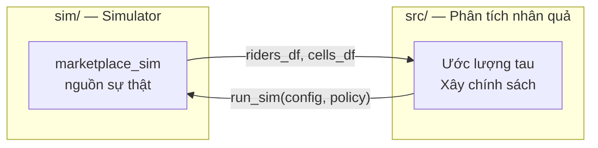
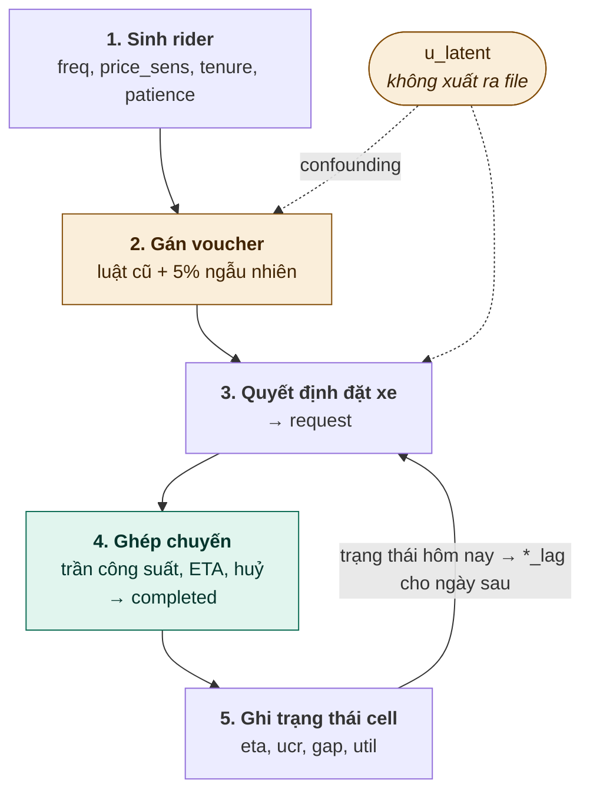

# Kiến trúc — Supply-Aware Promotion Uplift

**Cập nhật:** 18/09/2026 · Đi kèm `KE_HOACH.md`

---

## 1. Tổng quan

Hệ thống gồm hai nửa, nối với nhau qua một interface duy nhất:



Simulator có **hai vai trò**, và vai trò thứ hai mới là điểm mấu chốt:

| Vai trò | Dùng để |
|---|---|
| Sinh dữ liệu | Huấn luyện mô hình uplift |
| Chạy thử chính sách | Tính `V(π)` — ground truth mà dữ liệu thật không có |

Vì vậy interface `policy` phải chốt **trước khi viết dòng code nào**.

---

## 2. Cấu trúc thư mục (dự kiến khi hoàn thành)

```
supply-aware-promotion-uplift/
│
├── README.md                     # Cách chạy lại toàn bộ từ đầu
├── ARCHITECTURE.md               # File này
├── KE_HOACH.md                   # Kế hoạch 5 tuần
├── requirements.txt
├── Makefile                      # make data / make all / make check
│
├── sim/                          # ─── SIMULATOR (đóng băng sau tuần 3) ───
│   ├── __init__.py
│   ├── marketplace_sim.py        # Entry point: --selfcheck / --dump
│   ├── config.py                 # SimConfig: mọi tham số gom về đây
│   ├── riders.py                 # Khối 1: sinh rider + covariate
│   ├── assignment.py             # Khối 2: gán voucher (nơi cài confounding)
│   ├── demand.py                 # Khối 3: quyết định đặt xe → request
│   ├── matching.py               # Khối 4: ghép chuyến (trần công suất, WGC)
│   ├── state.py                  # Khối 5: ghi trạng thái cell → *_lag
│   └── selfcheck.py              # In 3 con số nghiệm thu + phân phối util_lag
│
├── src/                          # ─── PHÂN TÍCH ───
│   ├── __init__.py
│   ├── features.py               # WHITELIST feature + assert_no_realized()
│   ├── estimators.py             # DR-learner, tau(x), tau(x, s)
│   ├── policies.py               # treat_none/all, greedy, oracle
│   ├── policy_value.py           # V(pi) — gọi lại simulator
│   ├── budget.py                 # Phân bổ ngân sách theo ngưỡng điểm
│   ├── metrics.py                # Qini, AUUC, bootstrap CI
│   ├── sensitivity.py            # Placebo test, biến nhiễu giả
│   └── plots.py                  # Đường cong tau ~ util_lag, Qini curve
│
├── notebooks/                    # ─── KẾT QUẢ, theo thứ tự chạy ───
│   ├── 01_eda.ipynb              # Phân phối util_lag, completed theo cell
│   ├── 02_three_traps.ipynb      # Tái tạo +1% / +44% / +20.4%
│   ├── 03_baseline_qini.ipynb    # DR-learner không biết cung + Qini vs V(pi)
│   ├── 04_supply_aware.ipynb     # tau(x, s), đường cong, ngưỡng util*
│   ├── 05_policy_compare.ipynb   # Bảng V(pi) 4 chính sách + phản chứng
│   └── 06_error_decomposition.ipynb  # 3 nguồn sai số + sensitivity
│
├── tests/
│   ├── test_policy_value.py      # Cùng seed → cùng kết quả
│   ├── test_matching.py          # completed <= capacity, monotonic
│   ├── test_policies.py          # treat_all >= treat_none về request
│   └── test_features.py          # assert_no_realized() bắt được realized_*
│
├── data/                         # .gitignore — sinh lại bằng make data
│   └── sim/
│       ├── riders.parquet        # ~1M dòng
│       └── cells.parquet         # ~6k dòng
│
├── results/                      # Số liệu và hình cuối cùng
│   ├── figures/
│   │   ├── tau_vs_util.png       # Kết quả (1)
│   │   ├── qini_curves.png
│   │   └── policy_value_bar.png  # Kết quả (2)
│   ├── tables/
│   │   ├── three_traps.csv
│   │   ├── policy_comparison.csv # Kết quả (2)
│   │   ├── qini_vs_value.csv     # Kết quả (3)
│   │   └── error_decomposition.csv  # Kết quả (4)
│   └── frozen_config.json        # Tham số simulator lúc đóng băng
│
└── report/
    ├── critical_problems.tex     # Trang P1–P7 (đã có)
    ├── rct_bias.png
    ├── report.tex
    └── slides.tex
```

### Quy ước

- `sim/` và `src/` **không import lẫn nhau** trừ qua `run_sim`. Giữ ranh giới này
  để người viết simulator và người viết phân tích làm song song.
- Notebook **không chứa logic**, chỉ gọi hàm trong `src/` và vẽ. Mọi con số phải
  sinh ra từ code.
- `data/` nằm trong `.gitignore`. Tái tạo bằng `make data`.
- `results/frozen_config.json` ghi lại tham số + commit hash lúc đóng băng
  simulator. Đây là bằng chứng không sửa simulator sau khi phân tích.

---

## 3. Vòng lặp mô phỏng

Simulator chạy tuần tự theo ngày. Mỗi `(zone, day, hour)` là một **cell** độc lập
trong ngày đó, nhưng nối với hôm trước qua trạng thái lag.



Ô vàng là nơi cài **confounding (P5, P7)**, ô xanh là nơi **interference (P1, P3)**
sinh ra. Vòng lặp chạy `for day` bên ngoài, `for (zone, hour)` bên trong.

**Vòng phụ thuộc và cách phá.** `request` phụ thuộc ETA, ETA phụ thuộc số
`request`. Phá bằng cách cho rider quyết định dựa trên `eta_lag` (ETA hôm trước
cùng zone, cùng giờ). Vừa hợp lý về hành vi, vừa tránh phải giải điểm bất động
cho phía cầu.

**Warm-up.** Ngày 0 chưa có lag. Chạy 3 ngày warm-up, không xuất ra file.

---

## 4. Chi tiết từng khối

### Khối 1 — Sinh rider (`sim/riders.py`)

Mỗi cell có `n_riders ~ Poisson(λ_zh)` với `λ_zh` quanh 174, có hệ số theo giờ
(giờ cao điểm cao hơn) và theo zone.

```python
freq        ~ Gamma(2, 1.5)      # số chuyến/tuần
price_sens  ~ Beta(2, 2)         # 0..1
tenure      ~ Exponential(180)   # ngày dùng app
is_commuter ~ Bernoulli(0.35)
patience    ~ Beta(3, 2)         # 0..1, cao = chịu chờ
```

`u_latent[z, d, h] ~ Normal(0, σ_u)` là **shock theo cell**, không theo rider.
Hiểu như "hôm nay zone này có sự kiện". **Không xuất ra file.**

### Khối 2 — Gán voucher (`sim/assignment.py`)

Nơi cài **confounding (P5)** và **confounder ẩn (P7)**:

```python
p_treat = sigmoid(θ0
                + θ_gap  * gap_lag[z, h]       # ← confounding: zone thiếu cung
                + θ_u    * u_latent[z, d, h]   # ← confounder ẩn
                + θ_freq * freq_i)
treat_i = Bernoulli(p_treat)

if Bernoulli(explore_frac):                    # explore_frac = 0.05
    is_explore_i = 1
    treat_i = Bernoulli(0.5)                   # ghi đè, phá confounding
```

`θ_gap > 0`: zone càng thiếu cung càng nhiều voucher — đúng sai lầm của vận hành.

`discount_pct = 0.20 if treat else 0.0`

**Khi có `policy` truyền vào, toàn bộ khối này bị thay thế.**

### Khối 3 — Quyết định đặt xe (`sim/demand.py`)

```python
lift_i = α * (0.5 + price_sens_i) * discount_pct_i

utility_i = β0 + β_f*freq_i + β_c*is_commuter_i + β_h[h] + β_z[z]
          + lift_i
          - γ * eta_lag[z, h]          # kỳ vọng chờ, từ hôm trước
          + δ * u_latent[z, d, h]

request_i = Bernoulli(sigmoid(utility_i))
```

### Khối 4 — Ghép chuyến (`sim/matching.py`)

Trái tim của simulator. **Interference (P1, P3) sinh ra ở đây một cách tự nhiên**,
không cần lập trình riêng: `match_rate` và `realized_eta` là đại lượng dùng chung
cả cell, nên voucher của người này kéo tụt cơ hội của người khác.

**Bản A — trần công suất (làm trước, đủ cho 3 con số nghiệm thu):**

```python
R = số request trong cell
S = supply[z, h]
capacity     = S * 60 / (w0 + L)           # chuyến/giờ; w0 đón, L chở
match_rate   = min(1.0, capacity / R)
realized_eta = w0 * (1 + κ * max(0, R/capacity - 1))
```

**Bản B — thêm wild goose chase (P2, nếu kịp):**

Giải điểm bất động cho số tài xế rảnh `I`:

```
I = S - Q * (w(I) + L),    với   w(I) = k / sqrt(I)
```

`w(I) = k/√I` xuất phát từ hình học: khoảng cách tới tài xế gần nhất trong `I`
điểm rải đều tỉ lệ nghịch với căn bậc hai mật độ. Giải bằng
`scipy.optimize.brentq`, lấy nghiệm `I` lớn (cân bằng tốt). Vô nghiệm nghĩa là
đang ở vùng WGC: đặt `I` nhỏ, throughput tụt xuống dưới đỉnh. **Đây là chỗ đường
cong quay đầu đi xuống.**

**Hoàn thành chuyến:**

```python
matched_i   = Bernoulli(match_rate)
p_nocancel  = sigmoid(c0 + c1*patience_i - realized_eta / τ_cancel)
completed_i = matched_i * Bernoulli(p_nocancel)
```

### Khối 5 — Ghi trạng thái (`sim/state.py`)

```python
cells[z, d, h] = {
    "requests":    R,
    "completed":   sum(completed_i),
    "supply":      S,
    "eta":         realized_eta,
    "ucr":         1 - completed/requests,     # unfulfilled/cancel rate
    "supply_gap":  max(0, R - capacity),
    "utilization": (S - I) / S,
}
state[z][h] = cells[z, d, h]                   # → *_lag cho ngày d+1
```

**`ucr`** tài liệu gốc không định nghĩa. Chọn: **unfulfilled/cancel rate**, tỷ lệ
request không thành chuyến. Ghi rõ trong README.

Các cột `realized_eta`, `realized_ucr`, `realized_supply_gap` trong bảng `riders`
là trạng thái này ghi ngược xuống từng rider. **Chúng tồn tại chỉ để làm bẫy
(P6)** — không bao giờ được dùng làm feature.

---

## 5. Interface chính

Chốt trước khi viết code. Đây là hợp đồng giữa `sim/` và `src/`.

```python
def run_sim(
    config: SimConfig,
    policy: Callable | None = None,   # None → dùng luật cũ (sinh dữ liệu)
    days: int = 30,
    seed: int = 0,
) -> tuple[pd.DataFrame, pd.DataFrame]:
    """Trả về (riders_df, cells_df)."""
```

```python
def policy(features: pd.DataFrame) -> np.ndarray:
    """features: freq, price_sens, tenure, is_commuter, patience,
                 zone, hour, eta_lag, ucr_lag, gap_lag, util_lag
       return:   mảng 0/1, dài bằng len(features)
    """
```

Có interface này thì `policy_value` chỉ còn vài dòng:

```python
def policy_value(policy, config, days=30, seed=0) -> float:
    _, cells = run_sim(config, policy=policy, days=days, seed=seed)
    return cells["completed"].sum()
```

Và bốn chính sách nghiệm thu:

```python
treat_none   = lambda f: np.zeros(len(f), dtype=int)
treat_all    = lambda f: np.ones(len(f), dtype=int)
greedy_tau   = lambda f: (model.predict(f[COVS])        >= thr).astype(int)
greedy_tau_s = lambda f: (model_s.predict(f[COVS+LAGS]) >= thr_s).astype(int)
```

**Ngân sách.** Ngân sách là toàn cục nhưng `policy` được gọi theo từng cell.
Cách đơn giản: chuyển ngân sách thành **ngưỡng điểm** tính trước từ một lần chạy,
rồi policy chỉ so điểm với ngưỡng. Dễ hơn nhiều so với knapsack trực tuyến và đủ
cho đề tài.

---

## 6. Whitelist feature (`src/features.py`)

Chặn P6 ngay từ khâu chọn feature, không dựa vào việc nhớ:

```python
COVS = ["freq", "price_sens", "tenure", "is_commuter", "patience", "zone", "hour"]
LAGS = ["eta_lag", "ucr_lag", "gap_lag", "util_lag"]
ALLOWED = COVS + LAGS

def assert_no_realized(df: pd.DataFrame) -> None:
    bad = [c for c in df.columns if c.startswith("realized_")]
    if bad:
        raise ValueError(f"Post-treatment columns in feature set: {bad}")
```

Gọi `assert_no_realized` trước mỗi lần train. Code review tuần 3 grep thêm một
lần nữa toàn repo.

---

## 7. Chế độ `--selfcheck`

In ra đúng bốn bảng cần đối chiếu:

```
[1] Naive observational (toàn bộ dữ liệu, treat=1 vs treat=0)
    request    0.xxx → 0.xxx   (+xx%)
    completed  0.xxx → 0.xxx   (+x%)       ← kỳ vọng ~+1%

[2] Randomized slice (is_explore == 1)
    request    0.xxx → 0.xxx   (+xx%)
    completed  0.xxx → 0.xxx   (+xx%)      ← kỳ vọng ~+44%

[3] GTE (chạy lại 2 lần: treat_all vs treat_none)
    completed  tổng xxx → xxx  (+xx%)      ← kỳ vọng ~+20%

[4] Phân phối util_lag: p10 p25 p50 p75 p90
    ← phải trải từ vùng dư cung tới vùng căng cung
```

Bảng [4] quan trọng không kém ba bảng đầu. Nếu mọi cell đều dư cung thì tuần 4
không vẽ được đường cong.

---

## 8. Kế hoạch hiệu chỉnh

Chỉnh theo thứ tự, mỗi bước cố định các bước trước:

| Bước | Vặn nút | Để đạt |
|---|---|---|
| 1 | `base_supply`, hệ số giờ cao điểm | `util_lag` trải từ ~0.4 tới ~0.98 |
| 2 | `α` (độ mạnh voucher) | randomized `completed` ≈ +44% |
| 3 | *(không có nút riêng)* | GTE tự ra ~+20% nếu bước 1 đúng |
| 4 | `θ_gap` | naive `completed` ≈ +1% |
| 5 | `σ_u`, `θ_u`, `δ` | đủ để sensitivity có việc, không át bước 4 |

**Bước 3 không có nút vặn riêng.** Khoảng cách giữa +44% và +20% **sinh ra từ cơ
chế**, không phải từ tham số. Nếu GTE quá gần +44%, nghĩa là cung chưa đủ căng —
quay lại bước 1.

Dùng `--days 10` khi hiệu chỉnh, `--days 30` khi chốt.

---

## 9. Đánh đổi có chủ ý

| Quyết định | Được | Mất |
|---|---|---|
| Cell độc lập, tài xế không di chuyển giữa zone | Đơn giản, nhanh | Không mô hình hoá spillover giữa zone |
| Rider dùng `eta_lag` thay ETA thật | Phá vòng phụ thuộc | Rider hơi "chậm hiểu" so với thực tế |
| Supply cố định, không phản ứng với voucher | Đúng phạm vi đề tài | Bỏ qua phía tài xế |
| Matching mức tổng hợp, không mô phỏng từng cuốc | 1M dòng trong vài phút | Không có chi tiết không gian trong zone |

Ba cái đầu ghi vào phần hạn chế của báo cáo.

---

## 10. Thứ tự build trong tuần 2

| Ngày | Việc | Ai |
|---|---|---|
| T2 | Chốt `SimConfig` + chữ ký `run_sim`/`policy`. Skeleton chạy được với dữ liệu rác | Chung |
| T2–T3 | Khối 1, 2, 3, 5 + vòng lặp ngày + xuất file | A |
| T2–T3 | `policy_value` + 4 chính sách + test, chạy trên skeleton | B |
| T4 | Khối 4 bản A + `--selfcheck` | A |
| T4 | Hiệu chỉnh bước 1–2 | Chung |
| T5 | Hiệu chỉnh bước 3–5, chốt tham số | Chung |
| T5 | README: `ucr`, đánh đổi, tham số cuối | B |

Khối 4 bản B (WGC) để tuần 3 nếu còn thời gian.

**Chốt xong thì đóng băng:** ghi commit hash + toàn bộ tham số vào
`results/frozen_config.json`, sau đó không sửa nữa.

---

## 11. Ranh giới vai trò

Vì hai bạn vừa xây vừa phân tích, tách vai rõ:

- Người viết `sim/assignment.py` và `sim/matching.py` (nơi cài confounding và
  interference) **không** viết code trong `src/` cho tuần 3–4.
- Đến khi phân tích xong mới đối chiếu với tham số thật.

Cách này giữ được tinh thần "intern phải tự phát hiện" mà đề tài đặt ra, và là
điều đáng nhắc trong báo cáo.
